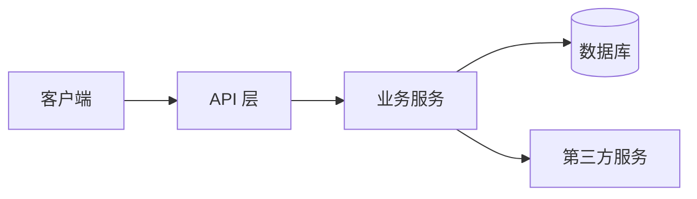

# {项目名} — 新人 30 分钟上手指南

> 本文件由 onboarding-archaeology skill 自动生成。读完这一份你应该能：
> 1. 用一句话说清这个项目是干啥的
> 2. 跑起来本地环境
> 3. 改对一个最常见的小需求
> 4. 知道哪里有坑别踩

---

## 1. 这是什么（1 分钟）

**业务一句话**：✅ / ⚠️ {xxx}

**面向用户**：

**核心价值**：

**当前阶段**：✅ / ⚠️ {MVP / 增长 / 成熟}

---

## 2. 技术架构（5 分钟）



- **前端**：
- **后端**：
- **数据库**：
- **关键第三方**：
- **部署形态**：

> 详细模块清单见 `progress/code-map.md`。

---

## 3. 跑起来本地（5 分钟）

```bash
# 1. 依赖
{安装命令}

# 2. 环境变量
cp .env.example .env
# 必填的关键变量：
#   - {KEY1}: {说明}
#   - {KEY2}: {说明}

# 3. 数据库初始化（如有）
{命令}

# 4. 启动
{命令}

# 5. 访问
{URL}
```

⚠️ 如果跑不起来，看 `progress/onboard-uncertainty.md` 第 X 条。

---

## 4. 一个常见小改动怎么做（10 分钟）

**示例任务**：{比如"给用户表加一个字段"}

涉及的文件：
1. `path/to/model` — 改数据模型
2. `path/to/migration` — 生成迁移
3. `path/to/api` — 暴露字段
4. `path/to/test` — 加测试

---

## 5. 5 个最危险的地雷（5 分钟）

1. ⚠️ **{地雷一}**：xxx（见 `path:line`，对应 lessons.md L?-001）
2. ⚠️ **{地雷二}**：
3. ⚠️ **{地雷三}**：
4. ⚠️ **{地雷四}**：
5. ⚠️ **{地雷五}**：

---

## 6. 我（AI）不确定的事 — 重要

下面这些事我考古时没搞清楚，**强烈建议你优先找原作者或前同事问清楚**：

详见 `progress/onboard-uncertainty.md`。

---

## 7. 我建议你接下来做什么

1. 先按本指南跑起来本地
2. 看 `progress/onboard-uncertainty.md`，找原作者把疑问问完
3. 复核 `contracts/api/_inferred.md`，确认无误后改名去掉 `_inferred`
4. 复核 `progress/lessons_inferred.md`，合并到 `progress/lessons.md`
5. 开始你的第一个 task（参考 `.harness/AGENTS.base.md` 的 Session 流程）

---

**onboarding-archaeology 自动生成于 {YYYY-MM-DD HH:MM}。耗时 {X} 分钟。**
